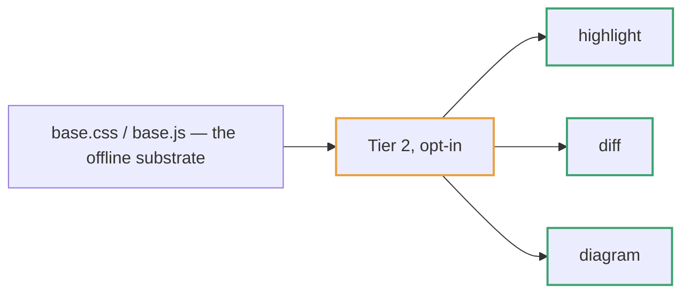

::: {.kicker}
TIER 2
:::

# Tier 2 components

::: {.lede}
The base substrate is offline and always present. A document that needs a **heavy renderer** — a diff viewer, a diagram engine — opts into a bundle instead of re-deriving the integration. **Only a page that uses one ships it.**
:::

## The bundles

| Bundle | Renders | Engine (CDN by default) |
|---|---|---|
| `components/highlight/` | `pre > code.language-*` | highlight.js v11 |
| `components/diff/` | `pre.diff-source` + `div.diff-render` | diff2html v3 |
| `components/diagram/` | `pre.mermaid` | mermaid v11 |
| `components/comments/` | reader comments (no markup) | — none; vanilla & offline |
| `components/reading-nav/` | `data-reading-filter` index + `__HTMLDOCS_NAV` page nav | — none; vanilla & offline |

Each bundle carries its own CSS and JS plus an `include.md`, which is the source of truth for wiring it: the version-pinned CDN tags, the markup contract, and the escaping rules the engine needs. **Follow the bundle's `include.md`** — do not reconstruct the wiring from memory.

::: {.callout variant=danger}
[Use the marker, ship the bundle]{.label} — writing `pre.mermaid` without shipping `components/diagram/` does not fail. The `<pre>` just renders as literal mermaid source and the reader sees the diagram's source code instead of the diagram.
:::

::: {.callout variant=warn}
[Serve over HTTP to see this page]{.label} — the diagram component is an ES module, so opening this file over `file://` leaves diagrams unrendered.
:::

## highlight — syntax highlighting

Tag the block with the language and highlight.js colors it. The palette follows the theme.

```typescript
// Color carries meaning — and every hue is spoken for.
interface Token { name: string; light: string; dark: string; }

function resolve(tokens: Token[], dark = false): Map<string, string> {
  return new Map(tokens.map((t) => [t.name, dark ? t.dark : t.light]));
}

const marks: Token[] = [
  { name: "--mark", light: "#ffe08a", dark: "#8a6a12" },
];
console.log(resolve(marks, /* dark */ true));
```

```{.nohighlight}
<pre><code class="language-typescript">…</code></pre>
<pre><code class="nohighlight">…</code></pre>  <!-- opt a block out -->
```

## diff — rendering a git diff

A hidden `pre.diff-source` holding a **valid unified diff**, immediately followed by an empty `div.diff-render`. The buttons switch the layout.

```{.diff-source}
diff --git a/assets/base.css b/assets/base.css
--- a/assets/base.css
+++ b/assets/base.css
@@ -72,3 +72,4 @@
   --card: light-dark(var(--n-50), var(--n-850));
-  --line: light-dark(var(--n-200), var(--n-700));
+  --line: light-dark(var(--n-200), var(--n-700));  /* hairline separator */
+  --edge: light-dark(var(--n-300), var(--n-650));  /* outline of a shape */
 }
```

## diagram — rendering a diagram

One `pre.mermaid` per diagram, holding mermaid source. The engine resolves the theme the same way `base.css` does, and re-renders when the theme changes.



## comments — a browser-side review layer

The odd one out: **no engine, no CDN, no markup to author.** It adds a Google-Docs-style review mode to any document — **select text below** and a `💬 コメント` button appears, or **right-click a block** for a menu. Each comment lands in the list panel in the right gutter (a 💬 toggle on narrow screens), and persists to this browser's `localStorage`.

::: {.callout variant=tip}
[This page is the live demo]{.label} — it ships the `comments` bundle, so the commenting works right here. Highlight this sentence and leave yourself a note; reload, and it is still anchored to the text.
:::

Anchoring never mutates the document DOM — the highlight is painted over the text with the CSS Custom Highlight API. Comments stay in the browser until you export them: the panel's toolbar writes **JSON** (re-importable, for round-tripping) or **Markdown** (a readable list for a human author or an agent to act on).

::: {.callout variant=warn}
[Local to one browser]{.label} — comments are not written back into the HTML and are not shared between viewers. A reviewer exports JSON/Markdown and sends it to the author out of band.
:::

## reading-nav — a multi-page reading site's navigation

Also engine-free and offline, for a **multi-page reading site** (a landing index plus report pages, as pdf-studio / paper-studio generate). It adds two runtime aids on top of `base.js`, and hardcodes no document-type vocabulary.

**A live index filter.** Mark any card index with `filter=` and the bundle inserts a search box above it; typing hides non-matching cards. The target and the placeholder are authored in the notation — `:::: {.card-grid filter="Filter…"}` — so nothing is hand-written in HTML. Try it on this index:

:::: {.card-grid filter="Filter…"}
::: {.card}
**Foundation** — headings, prose, tables, code, quotes: everything that reads correctly with no class at all.
:::
::: {.card}
**Color** — the meaning-only color model and the token layers behind it.
:::
::: {.card}
**Components** — the classes you opt into: callout, keypoints, card, chip, aside.
:::
::: {.card}
**Enhancement** — what `base.js` adds: the theme toggle, the table of contents, the reading-progress bar, back-to-top.
:::
::::

**Manifest-driven page-to-page navigation.** From one per-site `window.__HTMLDOCS_NAV` data file, the bundle renders **prev/next** links at the foot of this page and a **list FAB** (the three-lines button in the corner stack) opening an all-pages drawer — a different axis from `base.js`'s ☰ section TOC: pages vs. sections. Both are shown live here; this page is one entry in the reference site's manifest.

::: {.callout variant=tip}
[Injected, not authored]{.label} — like `comments`, reading-nav writes its own UI; you author only the `filter=` marker (for the filter) and the per-site `nav-manifest.js` data (for the page nav). The neighbor labels come from that data, so one bundle serves a book's chapters, a paper's perspectives, or any reading site unchanged.
:::
